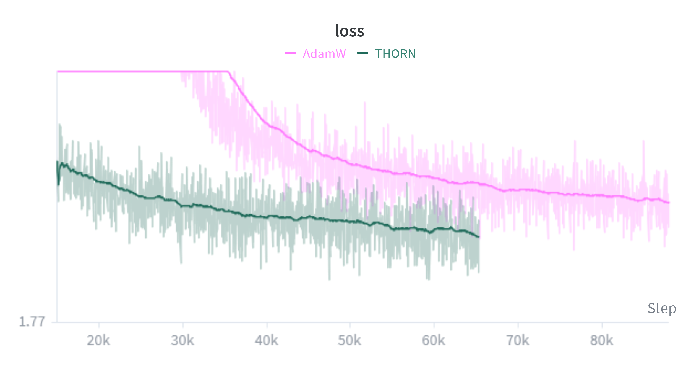

# THORN 🌹
THORN is an optimizer for PyTorch.

THORN is primarily based on [Muon][muon], which is quickly [replacing AdamW in the language model space](https://moonshotai.github.io/Kimi-K2/). THORN itself was used to train [Earshot](https://github.com/pykeio/earshot), a tiny voice activity detection model. THORN with minimal tuning provided a +2% validation accuracy boost over hand-tuned AdamW and made Earshot the most accurate VAD we tested in spite of its small size.

THORN works on any model, but it's most effective for models with lots of convolutions/linear layers. Transformer models will see the largest gains. It's best for pretraining; it doesn't provide much benefit over Adam for non-LoRA fine-tuning, unless the base model was also trained with Muon/THORN.

It won't give the *best possible* results, but you can often reuse AdamW's same LR/betas/weight decay with THORN, making it effectively a free accuracy boost:

<blockquote><figure>

<figcaption><i>

~300M Qwen3-based character-level causal language model on a simple dataset. $\gamma=10^{-3}$ (constant), $\beta_1=0.9$, $\beta_2=0.99$, $\lambda=0.1$ for both THORN & AdamW

</i></figcaption>
</figure></blockquote>

## Usage
Requires Python ≥ 3.12, PyTorch ≥ 2.6. [Triton](https://triton-lang.org/main/index.html) is optional but provides a decent speed boost. FSDP2 is supported & optimized for.

```shell
$ pip install git+https://github.com/pykeio/THORN.git
```

```python
from thorn import THORN
```

THORN has two 'sub-optimizer's: one for matrix parameters (`ConvXD` kernels/`Linear` weights), specified with `'orthogonalize': True`; and one for everything else, specified with `'orthogonalize': False`. The former is similar to [(Nor)][normuon]Muon, and the latter is essentially [(R)][radam]AdamW.

You *could* just give THORN your model and let it figure out which parameters to orthogonalize updates for and which to not:
```diff
-optim = AdamW(model.parameters(), lr=1e-3, betas=(0.9, 0.99), weight_decay=0.1)
+optim = THORN(model, lr=1e-3, betas=(0.9, 0.99), weight_decay=0.1)
```
<sup>Note the lack of `.parameters()` for THORN.</sup>

This will reuse the same parameters for orthogonalized-update & non-orthogonalized-update parameters, which isn't ideal. It also might orthogonalize your embedding/final output layer's updates, which isn't recommended. This method is still often better than Adam, but to get the most out of THORN, you should instead specify separate *parameter groups*:

```python
optim = THORN([
	{
		'orthogonalize': True,
		'params': [p for k, p in model.named_parameters() if p.ndim >= 2 and k not in ['output', 'embed']],
		'lr': 0.001,
		'betas': (0.95, 0.95),
		'weight_decay': 0.1
	},
	{
		'orthogonalize': False,
		'params': [p for k, p in model.named_parameters() if p.ndim < 2 or k in ['output', 'embed']],
		'lr': 0.001,
		'betas': (0.9, 0.995),
		'weight_decay': 0.03
	}
])
```

$\beta_1$ and $\beta_2$ work differently from Adam for orthogonalized-update parameters: $\beta_1$ is the SGD momentum $\alpha$, like Muon's `momentum` parameter, and is often $0.9–0.95$. $\beta_2$ controls the second-order momentum $\alpha$ used in [per-row normalization][normuon] for non-tall matrices and is typically set to $0.95$. $\beta_2$ can also be set to $0$ to disable per-row normalization entirely.

`weight_decay` ($\lambda$) is actually [cautious weight decay][cwd], so you should set it a bit higher than you normally would. $\approx0.1$ often works well.

There are a few more knobs you can tune besides the usual:
- `none_grad` (`bool`, ⚠️ **default `True`**) automatically sets gradients to `None` after the optimizer completes an update to save memory.
- `decouple_md` (`bool`, default `False`) factors each parameter into a separately learned magnitude & fixed-norm direction. This works for any parameter group (but not recommended for embeddings/output heads) and can improve learning by 10-20%, though the LR will require tuning.
	- `target_norm` (`Literal['init', 'min', 'max']`) specifies the norm the direction is fixed to: `init` uses the norm at initialization and is the default for non-orthogonalized-update parameters; `min` targets $\sqrt{\min(M, N)}$; `max` targets $\sqrt{\max(M, N)}$ and is the default for orthogonalized-update parameters.
- `scaling_mode` (`Literal['md', 'moonlight', 'jordan']`) selects which LR scaling method to use per orthogonalized-update parameter. `md` is the default when `decouple_md=True` since it performs best under magnitude-direction decoupling. `moonlight` is the default otherwise and effectively *allows Adam's LR to be directly reused*. `jordan` uses vanilla Muon's scaling.
	- `target_rms` (`float`, default $0.2$): When `scaling_mode='moonlight'`, this controls the target RMS of the update to roughly match that of Adam. Adam's update RMS is often between $\approx0.2–0.4$. $0.2$ is a good baseline but increasing to $0.4$ may give better results in some cases.
- `iters` (`int`, default $5$) controls the number of Newton-Schulz iterations performed when orthogonalizing updates. Bumping this up to $8$ improves precision for smaller singular values at the cost of extra compute; whether that matters for training is unclear. $5$ is the minimum number of iterations required to meaningfully converge.
- `momentum_align` (`bool`, default `False`) scales updates based on their alignment with the momentum & randomly masks updates. Per [Magma][magma], this combination can improve learning by ~10% and is stable over a larger range of learning rates.
- `rectify` (`bool`, default `True`) applies the variance rectification term from [RAdam][radam] to stabilize the momentum for non-orthogonalized-update parameters during the early stages of training. This usually reduces the need for warmup steps.
- `force_per_neuron_norm` (`bool`, default `False`) performs per-row normalization for *all* orthogonalized-update matrices. By default, per-row normalization is limited to *tall* matrices, which [has been found][aurora] to perform better than applying it to all matrices, at least for transformers. Non-transformers may benefit from enabling this.

For best results:
- **Exclude embedding layers from `orthogonalize: True` groups** since embeddings are vectors, not matrices. For language models, you should also exclude the output head.
- **Keep separate matrices separate**: for attention layers, don't merge the Q, K, and V projections into one single `qkv_proj`, and for GLU-style MLPs, don't merge `up_proj` and `gate_proj` into one.

## Optional features
If Triton is installed, THORN will use a custom kernel to speed up computation on larger matrix parameters by up to 50%. The `THORN_DISABLE_TRITON` environment variable can be set to `1` to disable it if problems arise.

The `THORN_COMPILE` environment variable can be set to `1` to use `torch.compile` for a slight speed boost. This is broken on Windows, so it's disabled by default.

THORN also supports sparse gradients for embedding layers created with `nn.Embedding(sparse=True)` to save a little extra memory on single-GPU setups.

## Gradient release mode
For further memory savings, you can limit gradients to one layer at a time with `setup_gradient_release`. This slows down FSDP significantly, so it is only recommended on single-GPU setups.

In gradient release mode, gradients are not kept around, so things like float16 mixed precision or gradient clipping will not work (but bfloat16 works).

```python
model = MyModel().to(dtype=torch.bfloat16)

gradient_accumulation_steps = 16

optimizer = THORN(...)
# enable gradient release mode
optimizer.setup_gradient_release(model, update_rate=gradient_accumulation_steps)
# traditional gradient accumulation doesn't work; set update_rate to approximate it instead

scheduler = CosineAnnealingLR(optimizer, ...) # optional

for i, item in enumerate(dataset):
	loss = model(item)
	loss.backward() # <- optimization is done here...

	if (i + 1) % gradient_accumulation_steps == 0:
		# ...so no need to manually step THORN when gradient release is used!
		#optimizer.step()
		#optimizer.zero_grad()

		# but do step the scheduler if you're using one
		scheduler.step()
```

With the gradient accumulation approximation (`update_rate` $\gt 1$), the *optimizer states* are accumulated over microbatches, rather than the gradients themselves; this often means a noisier update is applied. To mitigate this, you'll want to set a higher $\beta_1$ (especially for orthogonalized-update parameters) and/or use a lower learning rate.

## Based on
- Jordan, K., Jin, Y., Boza, V., You, J., Cesista, F., Newhouse, L., & Bernstein, J. (2024). [*Muon: An optimizer for hidden layers in neural networks.*][muon]
- Lim, J., Lee, S., Kim, D., Kim, T., Park, E., Lee, J., … Weon, D. (2025). [*Motif 2 12.7B technical report.*](https://arxiv.org/abs/2511.07464)
- Li, Z., Liu, L., Liang, C., Chen, W., & Zhao, T. (2025). [*NorMuon: Making Muon more efficient and scalable.*][normuon]
- Delattre, B., Barthélemy, Q., Araujo, A., & Allauzen, A. (2023). [*Efficient Bound of Lipschitz Constant for Convolutional Layers by Gram Iteration.*](https://arxiv.org/abs/2305.16173)
- Liu, J., Su, J., Yao, X., Jiang, Z., Lai, G., Du, Y., … Yang, Z. (2025). [*Muon is Scalable for LLM Training.*](https://arxiv.org/abs/2502.16982)
- Pudipeddi, B., Mesmakhosroshahi, M., Xi, J., & Bharadwaj, S. (2020). [*Training Large Neural Networks with Constant Memory using a New Execution Algorithm.*](https://arxiv.org/abs/2002.05645)
- Chen, L., Li, J., Liang, K., Su, B., Xie, C., Pierse, N. W., … Liu, Q. (2025). [*Cautious Weight Decay.*][cwd]
- Amsel, N., Persson, D., Musco, C., & Gower, R. M. (2025). [*The Polar Express: Optimal Matrix Sign Methods and Their Application to the Muon Algorithm.*](https://arxiv.org/abs/2505.16932)
- Liu, L., Jiang, H., He, P., Chen, W., Liu, X., Gao, J., & Han, J. (2021). [*On the Variance of the Adaptive Learning Rate and Beyond.*][radam]
- Zhang, Y., Han, Y., Cao, S., Dai, G., Miao, Y., Cao, T., … Xu, N. (2023). [*Adam Accumulation to Reduce Memory Footprints of both Activations and Gradients for Large-scale DNN Training.*](https://arxiv.org/abs/2305.19982)
- Zhang, J., Amsel, N., Chen, B., & Dao, T. (2026). [*Gram Newton-Schulz.*](https://dao-ailab.github.io/blog/2026/gram-newton-schulz/)
- Joo, T., Xia, W., Kim, C., Zhang, M., & Ie, E. (2026). [*On Surprising Effectiveness of Masking Updates in Adaptive Optimizers.*][magma]
- Everett, K., Xiao, L., Wortsman, M., Alemi, A. A., Novak, R., Liu, P. J., … Pennington, J. (2024). [*Scaling Exponents Across Parameterizations and Optimizers.*](https://arxiv.org/abs/2407.05872)
- Dewulf, A., Pai, D., Yang, L., Zhang, A., & Keigwin, B. (2026). [*Aurora: A Leverage-Aware Spectral Optimizer.*][aurora]
- Hägele, A., Hernández-Cano, A., Kosson, A., & Jaggi, M. (2026). [*Improving Neural Network Training by Decoupling the Magnitude and Direction of Weight Vectors.*][md]
- [Flash-Muon](https://github.com/nil0x9/flash-muon) by Tianyang Lin
- [optimī](https://github.com/warner-benjamin/optimi) by Benjamin Warner

[muon]: https://kellerjordan.github.io/posts/muon/
[normuon]: https://arxiv.org/abs/2510.05491
[radam]: https://arxiv.org/abs/1908.03265
[cwd]: https://arxiv.org/abs/2510.12402
[magma]: https://arxiv.org/abs/2602.15322
[md]: https://arxiv.org/abs/2606.25971
[aurora]: https://arxiv.org/abs/2606.27715
